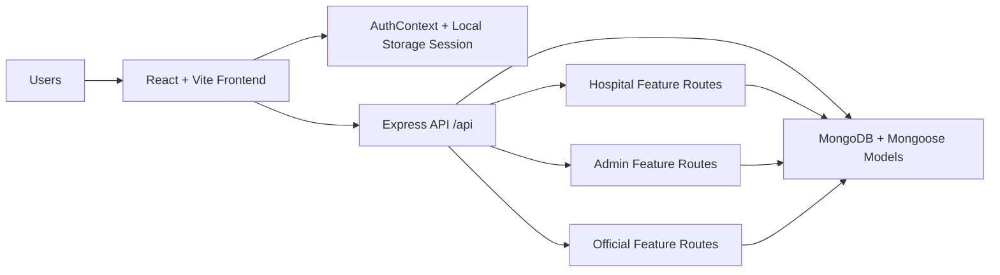
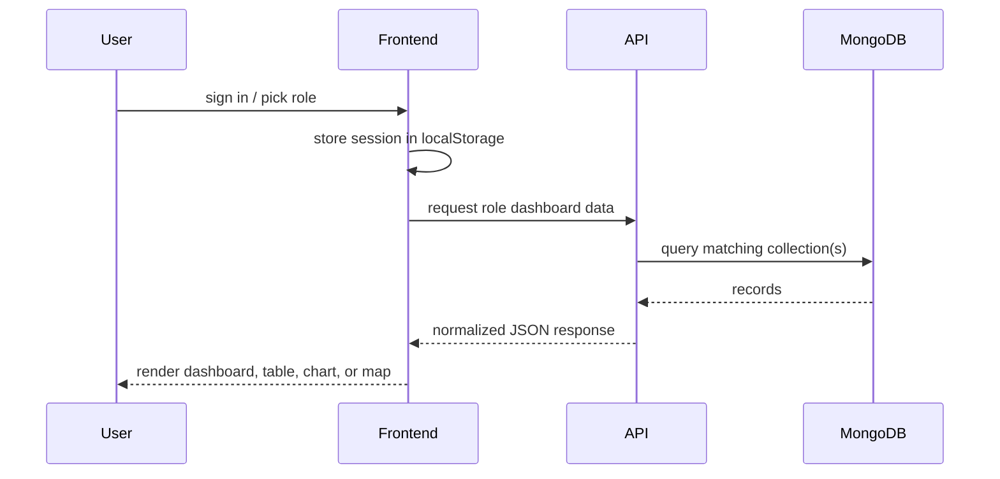

# Auralis Architecture

## Overview

Auralis is a role-based disease surveillance platform built with a React + Vite frontend, a Node.js + Express backend, and MongoDB/Mongoose for persistence. The app is organized around three separate user roles:

1. Hospital
2. Government Admin
3. Health Official

Each role has its own dashboard, actions, and data views, but all of them share the same authentication layer, API surface, and data model.

## System View

## Frontend Architecture

The frontend is a single-page app that uses React Router to switch between pages after login.

Main frontend layers:

- `src/pages/` for role-specific screens
- `src/components/` for reusable UI and dashboard widgets
- `src/lib/AuthContext.jsx` for session state and demo account handling
- `src/api/roleFeatureService.js` for role-based API calls
- `src/components/Layout.jsx` for the authenticated shell and role navigation

### Entry Flow

1. `Landing` is the public home screen.
2. `Login` handles sign-in, account creation, and password reset.
3. `RoleSelection` is shown after authentication.
4. `Layout` wraps the protected role dashboards.

## Backend Architecture

The backend is a REST API built with Express. It exposes two kinds of routes:

- Generic CRUD routes for core collections
- Role feature routes for admin, hospital, and official workflows

### Route Groups

- `/api/hospitals`, `/api/disease-alerts`, `/api/model-updates`, `/api/patient-data`, `/api/predictions`
- `/api/admin/*`
- `/api/hospital/*`
- `/api/official/*`

## Data Model

The current app uses MongoDB collections through Mongoose models:

- `Hospital`
- `DiseaseAlert`
- `ModelUpdate`
- `PatientData`
- `Prediction`
- `AppUser`
- `SystemLog`

These collections support both the dashboard summaries and the role-specific operational views.

## How The Three Roles Work

### 1. Hospital Role

Purpose: submit local surveillance data and monitor the hospital’s own model and history.

Frontend pages:

- Dashboard
- Upload Data
- Train Model
- Model Updates
- Data History
- Training History
- Model Performance

Backend routes used:

- `/api/hospital/data-history`
- `/api/hospital/training-history`
- `/api/hospital/model-performance`
- `/api/hospital/validate-data`

How it works:

1. The hospital user logs in with the hospital role.
2. The dashboard shows local totals, recent uploads, and training status.
3. Patient records are uploaded into the backend and stored in MongoDB.
4. The hospital can train a local model and review the resulting updates.
5. Historical rows and model quality can be filtered and reviewed later.

### 2. Government Admin Role

Purpose: manage the national view of hospitals, users, alerts, reports, and system activity.

Frontend pages:

- Dashboard
- Hospitals
- Alerts
- Analytics
- Federated Learning
- Model Performance
- User Management
- Reports & Export
- System Logs

Backend routes used:

- `/api/admin/model-performance`
- `/api/admin/users`
- `/api/admin/reports/analytics`
- `/api/admin/reports/export`
- `/api/admin/system-logs`

How it works:

1. The admin sees the national dashboard after sign-in.
2. The admin dashboard aggregates hospitals, alerts, and monitored records.
3. User management shows hospital admins and health officials derived from the data model.
4. Reports can be filtered and exported as CSV or PDF.
5. System logs combine stored logs and derived activity from alerts, training, and uploads.

### 3. Health Official Role

Purpose: monitor outbreaks, inspect spread patterns, and coordinate response actions.

Frontend pages:

- Dashboard
- Alerts
- Heatmap
- Analytics
- AI Prediction
- Reports
- Alert Detail

Backend routes used:

- `/api/official/heatmap-risk`
- `/api/official/analytics`
- `/api/official/alerts/:alertId/details`
- `/api/official/reports/summary`

How it works:

1. The health official logs in and sees the public-health dashboard.
2. The dashboard summarizes active outbreaks, regions affected, and trend views.
3. Heatmap and analytics views are filtered by region and date.
4. Alert detail pages show the alert record plus suggested response actions.
5. Reports provide outbreak summaries and top affected regions.

## Request Flow

## Frontend State And Auth

Authentication is currently client-managed for the demo workflow:

- Session data is stored in `localStorage`
- Demo users are available for the three roles
- Protected routes guard the role dashboards
- `Layout` changes navigation based on the current role path

## Operational Flows

### Hospital Data Flow

1. Upload or create patient records.
2. Backend stores them in `PatientData`.
3. Hospital dashboards and history pages query those records.
4. Training pages write model updates into `ModelUpdate`.

### Admin Data Flow

1. Admin reads aggregated metrics from hospitals, alerts, predictions, and logs.
2. Backend composes summaries from multiple collections.
3. Export endpoints package the data into CSV or PDF.

### Health Official Data Flow

1. Official reads outbreak records from `DiseaseAlert`, `PatientData`, and `Prediction`.
2. Backend groups the data by region, disease, and severity.
3. Frontend renders maps, charts, and per-alert recommendations.

## Security Model

Current protections:

- Role-based routing on the frontend
- Mongoose validation at the model layer
- Protected app routes after authentication
- Separation of role feature routes on the backend

Recommended production hardening:

- Server-side JWT authentication
- Role-based authorization middleware
- HTTPS everywhere
- Rate limiting
- Audit logging

## Why This Architecture Fits The App

This structure keeps each role focused on its own work:

- Hospital users manage data generation and local model activity.
- Government admins monitor the entire platform and export reports.
- Health officials respond to outbreaks and interpret regional risk.

At the same time, all three roles use the same backend collections, so the system stays consistent and easy to extend.
